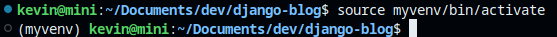
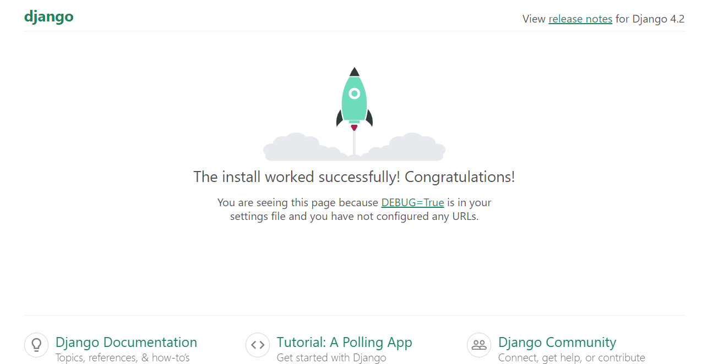

+++
title = "How to build a blog with Python Django - (Part 1) Installation"
date = 2023-12-12

description = "Django is a high-level, open-source Python web framework that simplifies the creation of complex, database-driven websites by providing tools and libraries for rapid development. Let's build a blog from scratch with it."

[taxonomies]
tags = ["web-development", "python"]

[extra]
quick_navigation_buttons = true
footnote_backlinks = true
toc = true
+++

# Django, Kezako ? 
Django is a high-level, open-source Python web framework that simplifies the creation of complex, database-driven websites by providing tools and libraries for rapid development. It follows the MVC (Model-View-Controller) pattern, emphasizing reusability, plug-ability, and rapid development. Django includes an ORM (Object-Relational Mapping) layer that enables interaction with various databases without directly writing SQL queries. It also includes a built-in admin panel, URL routing, templating system, and security features, making it a popular choice for building robust and scalable web applications.

# Installation
## Python
Python is a high-level, interpreted, and versatile programming language known for its simplicity and readability first released in 1991. Python emphasizes code readability and has a straightforward syntax that makes it accessible to beginners while also being powerful enough for professional developers. It is open-source, allowing users to freely use and contribute to its development. Finally, it has a vibrant and supportive community.

But Python is far from being the ultimate programming language. Because its code is interpreted, it is not very fast and consumes more memory. Python is not suitable for system and mobile applications. It is prone to facilitate coding errors because it is not compiled until runtime and is dynamically typed. Numerous issues that could typically be detected by the compiler remain latent until the program is executed.

Wow, so why use it ? Because it is one of the easiest programming languages ; it is flexible and suitable for a very wide range of tasks and almost dominant in Data science and machine learning areas ; it is portable, you can write and run Python code on almost every operating system and has a lot of other advantages.

* List of the biggest Python users and usages : [https://www.python.org/about/quotes/](https://www.python.org/about/quotes/)
* Python Use Cases – What is Python Best For? : [https://www.freecodecamp.org/news/what-is-python-best-for/](https://www.freecodecamp.org/news/what-is-python-best-for/)

I am a big python fan but enough advertising and let's go to work ...

<hr>
First, let's check if Python is already installed on your system : 

```bash
python --version
python3 --version
```

If the command if KO, let's proceed to the Python installation :

```bash
sudo apt-get install python3.7
```

## PIP
PIP stands for "Pip Installs Packages." It is the default Python package manager. It is used for installing and managing Python packages from the Python Package Index (PyPI) and other repositories. It simplifies the process of downloading and installing third-party Python libraries and dependencies.

I still assume you are on a Debian-based distribution. The quickest way to install PIP is as follows :

```bash
sudo apt update
sudo apt install python3-pip
```

* Know more about PIP : [https://pypi.org/project/pip/](https://pypi.org/project/pip/)

## Setting up a virtual environment
If you are familiar with package manager such as npm (for node.js) or cargo (for Rust), you know how easy it is to install and manage all your dependencies. But if you work on multiple applications with different versions of external dependencies, it could be a challenge to manage them all. 

PIP is no exception.

Let's say you have a `superApplication` using `superPackage 1.0` dependencies and a second application `evenBetterApplication` using `superPackage 2.1`. Let's assume `superPackage 2.1` is not retro-compatible with its first version. This can lead to conflict between your two applications.

Python provides a package named `virtualenv`. As its name suggests, this package allows you to create a virtual environment for your application and isolate it from other applications and does not affect any outer space of the system `vitualenv`.

Finally, you can easily share an environment by sharing the requirements file (`requirements.txt`) with the project code. Others can recreate the exact environment by installing the same dependencies specified in the requirements file, ensuring consistency across different development environments.

First of all, let's install the ``python3-virtualenv`` package :
```shell
sudo apt install python3-virtualenv
```

Then you need to install `vitualenv` with the package manager `pip` :
```shell
sudo pip install virtualenv
```

When it is done, point to your work directory `django-blog` and create a virtual environment withing the project :
```shell
virtualenv myvenv
```

To activate it withing your work directory (and install packages into your new virtual environment), execute the following UNIX command :
```shell
source myvenv/bin/activate
```

Your work directory is ready, you installed and set up your virtual environment. The last installation step is to install the `Django` package. Make sure you are in your virtual environment :



When you `source` your virtual environment, you can notice your terminal changes to include the name of your environment `(myvenv)`.

At anytime you can quit `myvenv` with the following command (don't do it for the next steps) :

```bash
deactivate
```

Now if you check your directory, you can notice that a new `myvenv` directory has been created. This is where all packages will be installed. It essentially contains binaries and configuration files. Make sure you don't commit this folder by creating a `.gitignore` file and fill it with `myvenv/` :

```bash
echo 'myvenv/' > .gitignore
```
* Know more about virtualenv : [https://virtualenv.pypa.io/en/latest/](https://virtualenv.pypa.io/en/latest/)
## Django
Now comes the hard part ... in fact not at all. You have done almost everything you need to set up a full Django environment. The last action is to actually install Django. Make sure you are in your virtual environment and type :
```bash
pip install django
```
You can verify that everything is OK by checking the version of "django-admin" (we will talk about it later) :

```bash
django-admin --version
```

The package `Django` is now installed in your virtual environment (you can check in `/myvenv/lib/` folder).

You can use the command `startproject` to auto-generate some code and the structure of your Django project. 

In your work directory :
```bash
django-admin startproject djangoblog .
```

*Note that you can't use "-" character in your Django project name.*

The final step is to use the build-in web server (it is a lightweight server written in Python. It is really useful during the development phase but it is not suitable for a production server) :

```bash
python manage.py runserver
```
The result on `http://127.0.0.1:8000/` :



Et voila !

