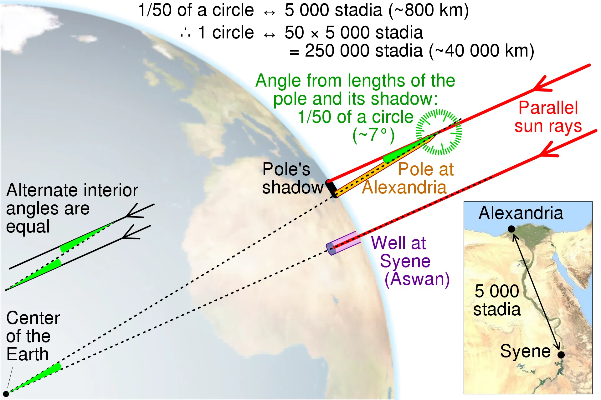
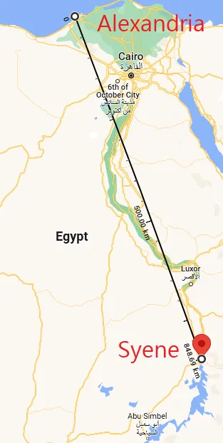

+++
title = "How did Eratosthenes calculate the circumference of the Earth 2200 years ago with an accuracy of 500km?"
date = 2022-12-03

description = "Eratosthenes was a Greek philosopher, astronomer, mathematician and poet born in 274 BC in Cyrene in present-day Libya and died in 194 BC in Alexandria, Egypt. He was a renowned scholar of his time and is famous for being the first whose method of measuring the circumference of the Earth is known today."

[taxonomies]
tags = ["science", "astronomy"]

[extra]
quick_navigation_buttons = true
footnote_backlinks = true
toc = false
+++

**Eratosthenes was a Greek philosopher, astronomer, mathematician and poet born in 274 BC in Cyrene in present-day Libya and died in 194 BC in Alexandria, Egypt. He was a renowned scholar of his time and is famous for being the first whose method of measuring the circumference of the Earth is known today.**

His method of calculation is described by another philosopher and astronomer Cleomedes in his elementary astronomy textbook “On the Circular Motions of the Celestial Bodies”. At that time, the roundness of the Earth had been admitted for more than 300 years by the Pythagorean school. Many estimations of the circumference of the Earth had already been done. Aristotle estimated the circumference of the Earth at about 60,000 km 200 years before Eratosthenes. But it was Eratosthenes who, by a clever geometrical journey, got the closest to it: 39.500 km instead of 40.007 km as calculated today.

# The experiment

Everything starts from the following hypothesis: On June 21, Eratosthenes noticed that there was no shadow in one of the wells of Syene (a city in Egypt), the sun was indeed perfectly perpendicular and illuminated the bottom of the well. This date corresponds to a phenomenon already known at the time: the summer solstice, the period of the year when the position of the sun is the highest (at noon at a local place) in the northern hemisphere.

On the same day and at the same time in Alexandria, a gnomon (an astronomical instrument used to follow the path of the sun) cast a shadow (other sources indicate a pole or a lighthouse, and even obelisk). By comparing the height of the gnomon and the projected shadow, Eratosthenes concluded that the angle of the sun’s ray is 1/50 of a circle, or about 7.2 degrees.

To complete the geometric theorem, all that remains is to calculate the distance between the cities of Alexandria and Syene: It is difficult to know if the philosopher used metrics known to the Bematists or if he calculated this distance himself. Legend says that he traveled this distance on camels (an animal with an extremely regular pace, which is ideal to calculate a distance based on travel time). It would have taken him 50 days to cover the distance, knowing that the animal covers 100 stadia (unit of distance used at the time), he concluded to a distance of 5000 stadia.

Considering the sun’s rays as parallel at any point on the Earth and using the method of congruent alternating-internal angles, 1/50 of the Earth’s circumference is equal to 5000 stadia, the circumference is therefore evaluated at 250,000 stadia. To find the equivalent of the value of the stadion, it is enough to know the real distance between Alexandria and Syene which is 790km. 790/5000 = 0.158km. One can thus consider that the stadion used by Eratosthenes is equal to 158m.

We thus arrive at (0,158\*50\*5000 =) 39 500 km!

# Useful mistakes

Even if Eratosthenes’ calculation was close to the truth, it was the result of several errors:

* He wrongly considered the meridians of Syene and Alexandria to be equal, but we know today that this is not the case (see image below).

* The postulate that the Earth is strictly round is false. The circumference that crosses the poles is 70km smaller than the circumference at the equator. The Earth is “flattened” at the poles.

* Finally, the sun’s rays are not parallel anywhere on Earth. But the sun is placed so far from the Earth that the angular distance is negligible. His experiment was not performed to the nearest millimeter, so the approximation is quite acceptable.

Because of the first hypothesis, the result could have been further from reality if the philosopher had not underestimated the distance between the two cities… which compensated for his error!