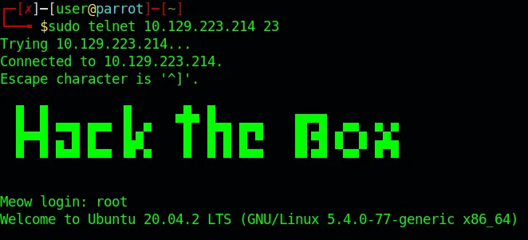
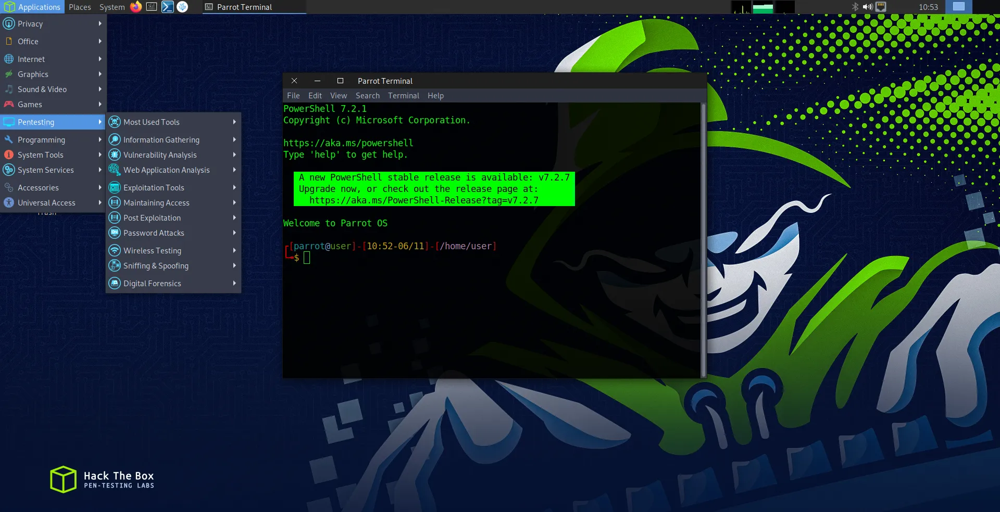
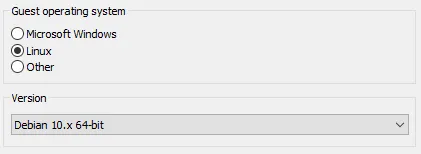
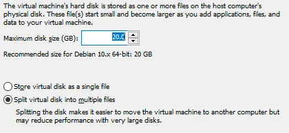
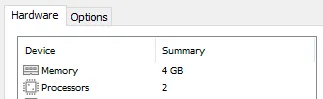
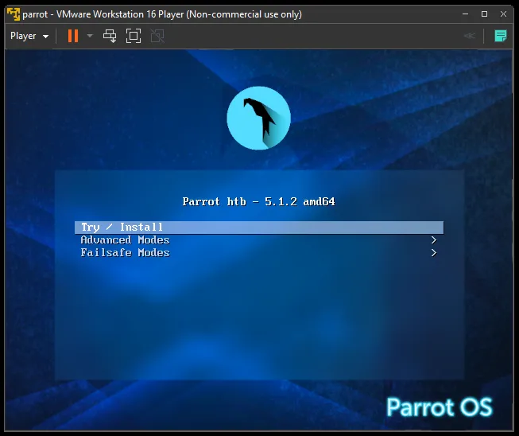
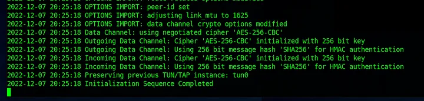
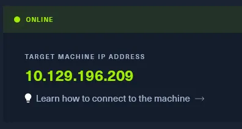

+++
title = "Hacking : “Meow” Machine or an Introduction to HackTheBox"
date = 2023-01-07

description = "Hack The Box is a massive hacking playground, and infosec community of members who learn, hack, play, exchange ideas and methodologies. One of the main feature of HTB is “Labs”. Every lab is a generate machine dedicated to apply what you have learned. There are a lot of labs, from the easiest one to the more insane. Each lab or “machine” has a name, and you have to answer questions and, finally, retrieve the flag to complete it. Here we have “Meow” machine. This is the very first machine and a very good introduction to let you install your hacking environment ands experiment HTB. So let’s explore it."

[taxonomies]
tags = ["hacking", "IT security"]

[extra]
quick_navigation_buttons = true
footnote_backlinks = true
toc = false
+++


**Hack The Box is a massive hacking playground, and infosec community of members who learn, hack, play, exchange ideas and methodologies. One of the main feature of HTB is “Labs”. Every lab is a generate machine dedicated to apply what you have learned. There are a lot of labs, from the easiest one to the more insane. Each lab or “machine” has a name, and you have to answer questions and, finally, retrieve the flag to complete it. Here we have “Meow” machine. This is the very first machine and a very good introduction to let you install your hacking environment ands experiment HTB. So let’s explore it.**

# Install a Parrot VM

The first step to try out HTB lab is to have a proper machine suited for hacking purposes and there are 3 options :

* Connect to a Pwnbox : A Pwnbox is a customized hacking cloud box that lets you hack all HTB Labs directly from the browser. This is the easiest way for beginners. No need for Virtual Machine or VPN, but the HTB free tier allow only 2h lifetime of Pwnbox.

* Use your own machine : If you have a set of hacking tools already installed in your computer, you can use it. But first, you have to connect your machine to HTB network using **OpenVPN**. I would not recommend this method, you better use an isolated Virtual Machine to ensure maximum security.

* Use a Virtual Machine : This is the recommended method for security and performance reasons. You can install the Operating System you want, but notes that you will have to install a lot of hacking and network tools to be operational. It exists OS designed for digital forensics and penetration testing, such as **Kali Linux** or **ParrotOS**.

There are several ways to install a Virtual Machine on your computer. For our use case, I would recommand the use of a virtualization software such as VMWare Player or VirtualBox. Finally, I tried a lot of Linux/UNIX based OS and I would suggest ParrotOS. So, let’s install a ParrotOS Virtual Machine on VMWare Player :



* First, download and install VMWare Player : [https://www.vmware.com/fr/products/workstation-player.html](https://www.vmware.com/fr/products/workstation-player.html)

* Download a ParrotOS ISO : [https://parrotsec.org/download/](https://parrotsec.org/download/). Note that for a while, Parrot provide a customized image adapted to Hack The Box labs and academy.


* On VMWare Player, create a VM and load your ParrotOS image :


* Most of the time, VMWare will detect the OS and customized the VM with the best options. If VMWare doesn’t detect the OS, you can select Debian 10 (ParrotOS is based on Debian) :



* In the next step, select at least 20gb of disk space on a virtual disk into multiple file :



* VMWare will create the VM on the location you selected. Once done, I suggest you to customized your VM and set the memory size to 4Gb and 2 processor cores :



* You can now start your VM :



# Connect to HTB VPN and spawn the machine

Start your virtual machine and go to HTB labs to begin the Meow challenge. The first step is to connect your VM to Starting Point VPN before starting the HTB machine. On the right panel, select “OpenVPN”, select the VPN access and server and download the **.ovpn** file.


This files contains the VPN configuration you can use as an argument to OpenVPN in your ParrotOS VM :

```bash
┌─[✗]─[user@parrot]─[~]
└──╼ $sudo openvpn yourfile.ovpn
```

You should be connected to HTB VPN if you have this message :



You can now spawn the machine so HTB will create an instance and prompt the IP you will have to use.



You are now ready to answer the 9 questions of this lab. Here few tips :

* You can ping the machine you have spawned :

```bash
┌─[user@parrot]─[~]
└──╼ $ping 10.129.223.214
PING 10.129.223.214 (10.129.223.214) 56(84) bytes of data.
64 bytes from 10.129.223.214: icmp_seq=1 ttl=63 time=49.9 ms
64 bytes from 10.129.223.214: icmp_seq=2 ttl=63 time=48.4 ms
64 bytes from 10.129.223.214: icmp_seq=3 ttl=63 time=44.1 ms
^C
--- 10.129.223.214 ping statistics ---
3 packets transmitted, 3 received, 0% packet loss, time 2003ms
rtt min/avg/max/mdev = 44.142/47.491/49.939/2.450
```

* You can check for open port :

```bash
┌─[user@parrot]─[~]
└──╼ $nmap 10.129.223.214
Starting Nmap 7.92 ( https://nmap.org ) at 2022-12-07 18:20 UTC
Nmap scan report for 10.129.223.214
Host is up (0.062s latency).
Not shown: 999 closed tcp ports (conn-refused)
PORT   STATE SERVICE
23/tcp open  telnet

Nmap done: 1 IP address (1 host up) scanned in 2.13 seconds
```

* And use the open ports with appropriate tools :

```bash
┌─[✗]─[user@parrot]─[~]
└──╼ $sudo telnet 10.129.223.214 23
Trying 10.129.223.214...
Connected to 10.129.223.214.
Escape character is '^]'.

  █  █         ▐▌     ▄█▄ █          ▄▄▄▄
  █▄▄█ ▀▀█ █▀▀ ▐▌▄▀    █  █▀█ █▀█    █▌▄█ ▄▀▀▄ ▀▄▀
  █  █ █▄█ █▄▄ ▐█▀▄    █  █ █ █▄▄    █▌▄█ ▀▄▄▀ █▀█


Meow login: root
Welcome to Ubuntu 20.04.2 LTS (GNU/Linux 5.4.0-77-generic x86_64)
```