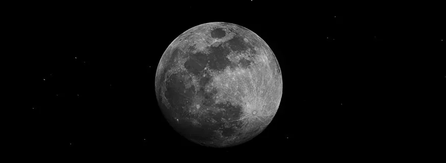
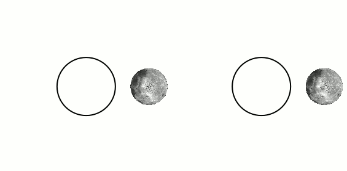

+++
title = "Why does the moon only show us one side?"
date = 2022-12-02

description = "The Moon is the easiest astronomical object to observe. Simply raise your head on a clear night to see it (except during the new moon phases, when it is positioned between the Earth and the Sun). No need for an astronomical device, your eyes are enough. If you want to appreciate its surface, simple binoculars can be useful. But after accurate observation, humans have realized that the Moon always shows the same side. It is however in revolution around the Earth and in rotation on itself, so why can’t we see it in its entirety?"

[taxonomies]
tags = ["space", "science", "astronomy"]

[extra]
quick_navigation_buttons = true
footnote_backlinks = true
+++

**The Moon is the easiest astronomical object to observe. Simply raise your head on a clear night to see it (except during the new moon phases, when it is positioned between the Earth and the Sun). No need for an astronomical device, your eyes are enough. If you want to appreciate its surface, simple binoculars can be useful. But after accurate observation, humans have realized that the Moon always shows the same side. It is however in revolution around the Earth and in rotation on itself, so why can’t we see it in its entirety?**

It is a fact that the Moon always reveals the same side to us and that is why we sometimes speak of “near side” and “far side” of the Moon to distinguish them. Before the flyby and the photographing of the “hidden” side by the Russian probe **Luna 3** on *October 7, 1959*, we knew very little about this side[^1]. Thanks to these photos, a first cartography could be made by the Academy of Sciences of the USSR in the *60s*. The Russians, in advance in the space exploration race at that time, sent a second probe, **Zond 3**, on *July 20, 1965* with a much better photographic resolution instrumentation than its predecessor improving the knowledge of the far side of the Moon.

Humans have also been able to see it with their own eyes during the **Apollo 8**, **Apollo 10** and **Apollo 17** flybys mission, but it has never been stepped on by humans. The Chinese space probe Chang’e 4, however, managed the achievement of landing the first spacecraft on *January 3, 2019*.

The Moon turns around itself, its rotation, and turns around the Earth, its revolution, in an elliptical orbit in about *27.32 days*. Naively, one could think that this celestial mechanics would allow us, over time, to observe the entire surface of the Moon. This is not the case. After observation, one conclusion is obvious: Its rotation period is strictly equal to its revolution period.

It is hard to imagine that these two movements are naturally synchronized. Mechanically, the probability of synchronizing them is low. No, randomness has no place in this phenomenon, there is actually a physical explanation: This rotation-revolution synchronism is due to what is called the **tidal force**.

Scientists are convinced: several million years ago, the Moon rotated more rapidly on itself. There was therefore no notion of a hidden/far side because, with patience, its entire surface was observable. However, this tidal force slowed down its rotational movement until it reached a point of equilibrium equal to the period of revolution, we speak of a **spin-orbit resonance 1:1**.

The tidal force results from the difference between the differential value of the forces of inertia applied to two celestial objects and the average value of this force of inertia applied to its center of inertia. More generally, it is a consequence of the non-uniformity of the gravitational force applied to a celestial body by the totality of the objects that surround it. In our case, the closest spot of the Moon to the Earth is affected by a greater force than the farthest spots, which explains the evolution of the rotation period of the Moon towards the period of revolution[^2]. This is also called **tidal locking**.

Note that this force also has an effect on the distance of the two celestial objects: It increases if the period of revolution is greater than the period of rotation of the celestial object and decreases in the opposite case.

[^1] *Even if the libration of the Moon (oscillation which makes its axis of rotation not perfectly perpendicular to the plane of its orbit) has allowed, after fine calculations, to conclude that we can observe 59% of the Moon and not its half if its axis was perfectly perpendicular*.

[^2] *This is far from being a rare phenomenon since many natural satellites are in synchronous rotation like Phobos and Deimos around Mars. Moreover, in the absence of external perturbation, any object in circular orbit around another will result in a synchronous rotation if the orbit is not too eccentric*.