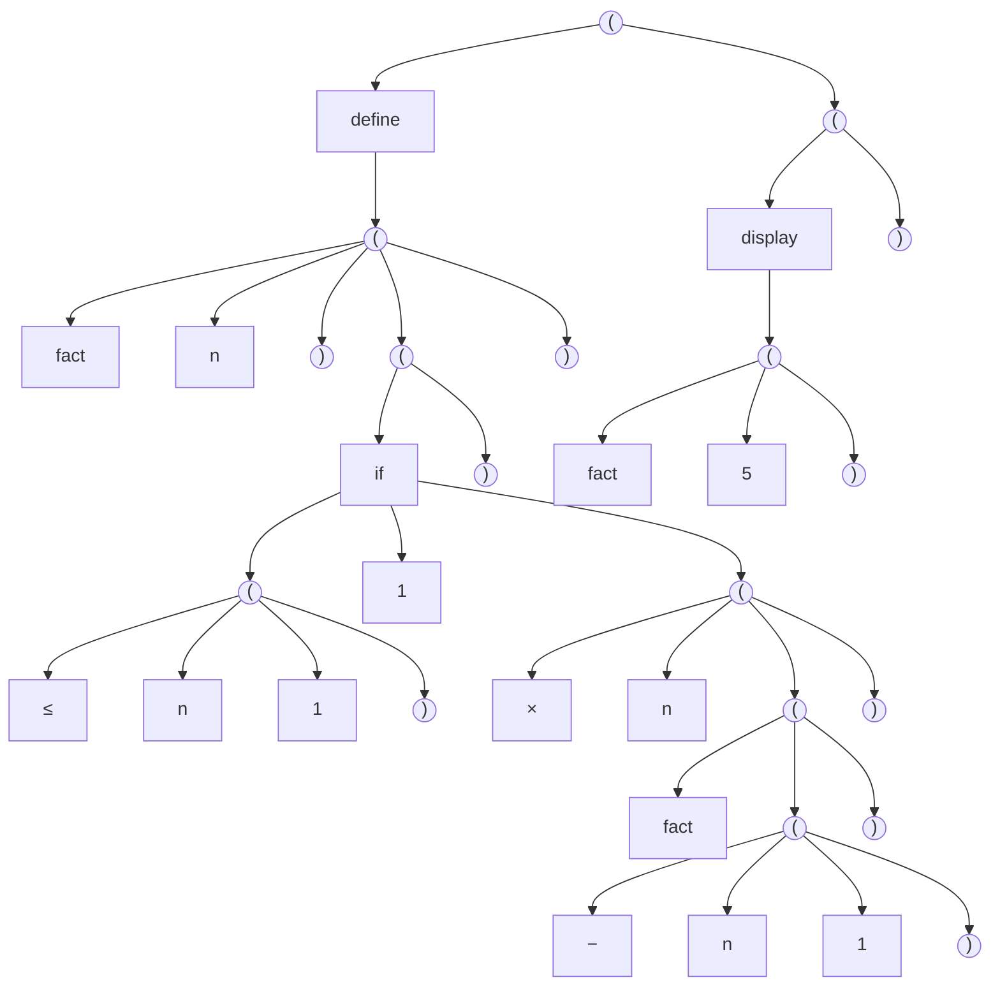

<!-- toc -->

# Foreword

Creating a programming language has always fascinated me. This is not an expert’s guide but a learning journey, where I explore the fundamental steps of language design by building a simple Lisp-like language from scratch. Instead of just reading theory, I will experiment, make mistakes and refine my understanding along the way.

This article documents my approach to creating a language syntax that look like Lisp (but simpler) and to writing a lexer/parser. By working through these concepts, I aim to develop both a deeper understanding of programming language theory and a working foundation for my own language.

This is more of a learning journey, figuring things out as I go.

# First step, define a language syntax

This language is a Lisp-like programming language designed for educational purposes, let's name it eLisp (for easy Lisp). It focus on simplicity while retaining essential Lisp features.
It adopts Lisp’s :

- parenthesized syntax (or S-expression)
- functional paradigm
- prefix notation

Whith a big diffrence :

- It restricts transitivity in mathematical operations for easier parsing and comprehension

In Lisp, the following code does the transitive multiplication of $n*m*p$ implicitly

```lisp
(* n m p)
```

While in eLisp we have to explicitly express the two multiplications such as :

```lisp
(* n ( * m p))
```

And finally, the language includes the minimal keyword and functionnality : constructs for defining functions, conditionals, loops, variable assignment and input/output operations.

Here comes a very quick documentation for the language :

<style>
.bloc{
    border: 2px solid #aaaaaa;
	padding: 10px;
	background-color: #E0E0E0;
	font-family: verdana;
}
</style>

<div class="bloc">

## Quick documentation of our eLisp syntax

As with traditional Lisp, all expressions are enclosed within parentheses and follow a prefix notation (Polish notation). This eliminates operator precedence concerns and maintains a consistent parsing structure.

- ### Function Definition: `define`

Functions are defined using the `define` keyword, followed by the function name, a list of parameters and the function body. The body consists of a single expression, which represents the return value.

```lisp
(define (fact n)
  (if (<= n 1)
      1
      (* n (fact (- n 1)))))
```

- ### Conditionals: `if`

The `if` expression evaluates a condition and executes one of two possible branches based on the result. The first argument is the condition, the second is the expression executed if the condition is true and the third is the expression executed if the condition is false

```lisp
(if (<= n 1)
    1
    (* n (fact (- n 1))))
```

- ### Output: `display`

The `display` function prints a value or a string to the output.

```lisp
(display "Hello, World!")
(display (fact 5))
```

- ### Loops: `while` and `for`

#### `while`

The `while` loop repeats execution of a block as long as the condition is true. The loop body can consist of multiple expressions.

```lisp
(while (< x 10)
  (set x (+ x 1)))
```

#### `for`

The `for` loop iterates over a range of values, with an initial value, an upper bound and an implicit increment of 1.

```lisp
(for (i 0 10)
  (display i))
```

- ### Constants: `const`

Constants are defined using `const`, which assigns an immutable value to a symbol.

```lisp
(const PI 3.14159)
(define (circle-area r)
  (* (* PI r) r))
(display (circle-area 5))
```

- ### Variable Assignment: `set`

The `set` expression assigns a new value to an existing variable.

```lisp
(set x 5)
(set x (+ x 1))
```

- ### User Input: `read`

The `read` function captures user input and assigns it to a variable.

```lisp
(display "Enter a number:")
(set x (read))
(display (* x x))
```

</div>

# Second step, create a structured representation

The next steps in this process is to transform raw code into a structured representation. This involves two key stages :

1. Lexical analysis (lexing or lexer) : breaking the source code into tokens, the fundamental building blocks of syntax.
2. Syntax analysis (parsing or parser) : organizing these tokens into a parse tree, which represents the hierarchical structure of the code according to the language’s grammar.

So basically, for this very basic eLisp code :

```lisp
(define (fact n)
  (if (<= n 1)
      1
      (* n (fact (- n 1)))))

(display (fact 5))
```

We would like to structure the raw code into a hierarchical structure such as a tree.



And since we have the syntax rule of our code, we can tokenize a raw eLips file according to a predefined set of rules we previously established. And that's what a `lexer` is. It processes source code and converts it into a series of tokens that a parser can use. So the `lexer` :

- Recognizes identifiers, keywords, numbers, operators and punctuation of the raw code
- Ignores whitespace and comments (those are just to make reading easier, but useless for code recognition and execution)
- Report errors for unrecognized characters (Don't need to continue and execute the program if the raw code is wrong at the first place)

So, we let's code a lexer (in python because the regex library is simple and powerful) that takes eLisp code  in input and creates a list of token in output such as :

```text
Token([type of token], [value of the token], [position of the token])
Token([type of token], [value of the token], [position of the token])
Token([type of token], [value of the token], [position of the token])
...
```

With the following types of tokens :

```python
('NUMBER', r'\d+(\.\d+)?')
('IDENTIFIER', r'[A-Za-z_][A-Za-z0-9_-]*')
('OPERATOR', r'[\+\-\*/<>=]+')
('LPAREN', r'\(')
('RPAREN', r'\)')
('WHITESPACE', r'\s+')
('COMMENT', r';.*')
('UNKNOWN', r'.')
```

And keywords :

```python
{'if', 'while', 'for', 'set', 'display', 'define', 'const', 'read'}
```

The lexer code is :

```python
import re
import sys

TOKEN_SPECIFICATION = [
    ('NUMBER', r'\d+(\.\d+)?'),
    ('IDENTIFIER', r'[A-Za-z_][A-Za-z0-9_-]*'),
    ('OPERATOR', r'[\+\-\*/<>=]+'),
    ('LPAREN', r'\('),
    ('RPAREN', r'\)'),
    ('WHITESPACE', r'\s+'),
    ('COMMENT', r';.*'),
    ('UNKNOWN', r'.')
]

KEYWORDS = {'if', 'while', 'for', 'set', 'display', 'define', 'const', 'read'}

class Token:
    def __init__(self, TokenType, TokenValue, TokenPosition):
        self.TokenType = TokenType
        self.TokenValue = TokenValue
        self.TokenPosition = TokenPosition

    def __repr__(self):
        return f'Token({self.TokenType}, {repr(self.TokenValue)}, {self.TokenPosition})'

class Lexer:
    def __init__(self, sourceCode):
        self.sourceCode = sourceCode
        self.tokens = []

        self.token_regex = re.compile('|'.join(f'(?P<{name}>{pattern})' for name, pattern in TOKEN_SPECIFICATION))

    def tokenize(self):
        for match in self.token_regex.finditer(self.sourceCode):
            TokenType = match.lastgroup
            TokenValue = match.group()
            TokenPosition = match.start()

            if TokenType == 'WHITESPACE' or TokenType == 'COMMENT':
                continue
            if TokenType == 'IDENTIFIER' and TokenValue in KEYWORDS:
                TokenType = 'KEYWORD'
            if TokenType == 'NUMBER':
                TokenValue = float(TokenValue) if '.' in TokenValue else int(TokenValue)

            self.tokens.append(Token(TokenType, TokenValue, TokenPosition))

        return self.tokens

def process_file(filename):
    try:
        with open(filename, 'r') as file:
            code = file.read()
        
        lexer = Lexer(code)
        tokens = lexer.tokenize()

        for token in tokens:
            print(token)
    except FileNotFoundError:
        print(f"Error: File '{filename}' not found.")
        sys.exit(1)

if __name__ == "__main__":
    if len(sys.argv) != 2:
        print("Usage: python3 main.py <filename>")
        sys.exit(1)
    
    filename = sys.argv[1]
    process_file(filename)
```

Let's try it :

```bash
> python.exe main.py code.elisp
Token(LPAREN, '(', 0)
Token(KEYWORD, 'define', 1)
Token(LPAREN, '(', 8)
Token(IDENTIFIER, 'fact', 9)
Token(IDENTIFIER, 'n', 14)
Token(RPAREN, ')', 15)
Token(LPAREN, '(', 19)
Token(KEYWORD, 'if', 20)
Token(LPAREN, '(', 23)
Token(OPERATOR, '<=', 24)
Token(IDENTIFIER, 'n', 27)
Token(NUMBER, 1, 29)
Token(RPAREN, ')', 30)
Token(NUMBER, 1, 38)
Token(LPAREN, '(', 46)
Token(OPERATOR, '*', 47)
Token(IDENTIFIER, 'n', 49)
Token(LPAREN, '(', 51)
Token(IDENTIFIER, 'fact', 52)
Token(LPAREN, '(', 57)
Token(OPERATOR, '-', 58)
Token(IDENTIFIER, 'n', 60)
Token(NUMBER, 1, 62)
Token(RPAREN, ')', 63)
Token(RPAREN, ')', 64)
Token(RPAREN, ')', 65)
Token(RPAREN, ')', 66)
Token(RPAREN, ')', 67)
Token(LPAREN, '(', 70)
Token(KEYWORD, 'display', 71)
Token(LPAREN, '(', 79)
Token(IDENTIFIER, 'fact', 80)
Token(NUMBER, 5, 85)
Token(RPAREN, ')', 86)
Token(RPAREN, ')', 87)
```

Cool, the lexer successful tokenized our eLisp raw code. The next step is to convert tokens into an AST (Abstract Syntax Tree). And it will be in another article.
