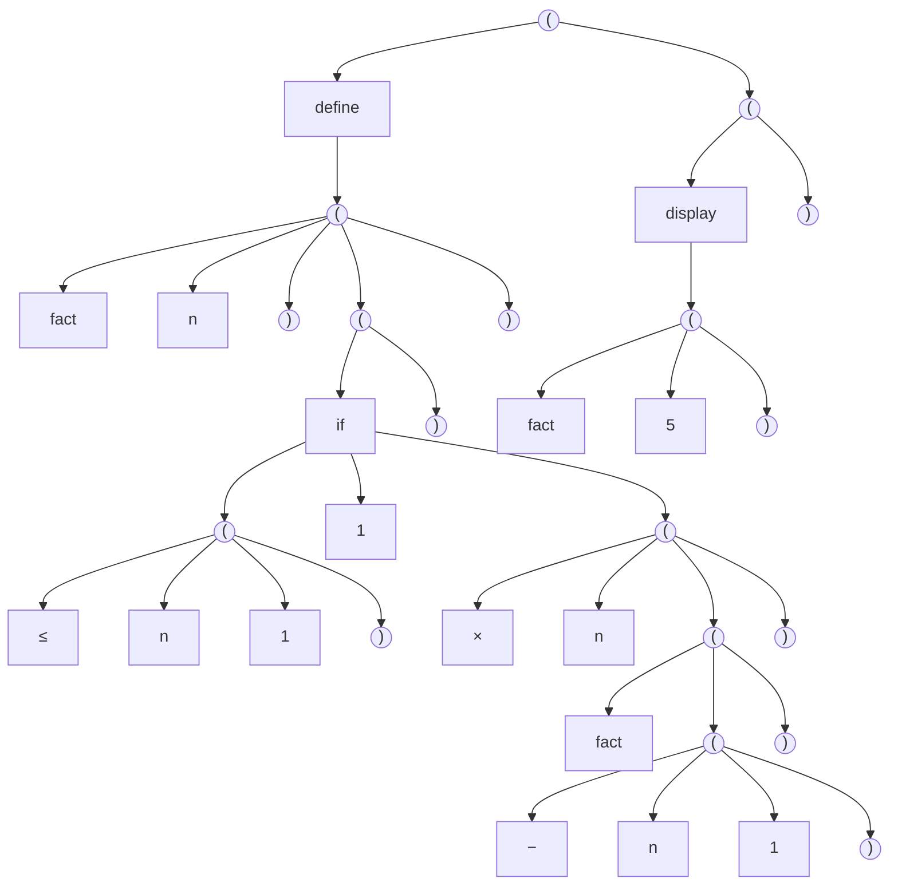
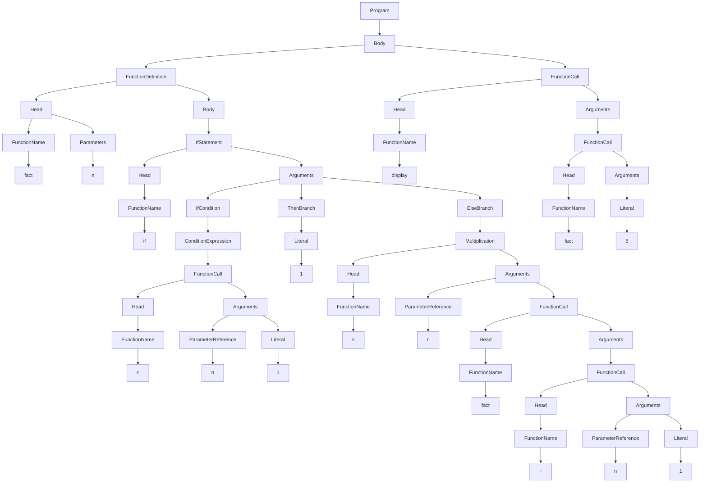

***

## abbrlink: building-a-lisp-like-language-from-code-to-concrete-syntax-tree

<!-- toc -->

# Foreword

Creating a programming language has always fascinated me. This is not an expert’s guide but a learning journey, where I explore the fundamental steps of language design by building a simple Lisp-like language from scratch. Instead of just reading theory, I will experiment, make mistakes, and refine my understanding along the way.

This article documents my approach to writing a lexer and parser, leading to the construction of a Concrete Syntax Tree (CST). By working through these concepts, I aim to develop both a deeper understanding of programming language theory and a working foundation for my own language.

This is more of a learning journey, figuring things out as I go.

# First step, define a language syntax

Todo

# Second step, create a structured representation

The next steps in this process is to transform raw code into a structured representation. This involves two key stages:

1. Lexical analysis (lexing) – breaking the source code into tokens, the fundamental building blocks of syntax.
2. Syntax analysis (parsing) – organizing these tokens into a parse tree, which represents the hierarchical structure of the code according to the language’s grammar.

## Use Case 1 : Function and condition

For this elisp code :

```lisp
(define (fact n)
  (if (<= n 1)
      1
      (* n (fact (- n 1)))))

(display (fact 5))
```

### Parse Tree



### Concrete Syntex Tree


